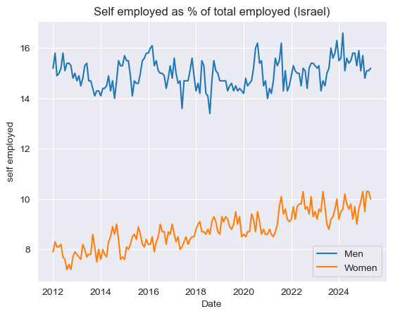
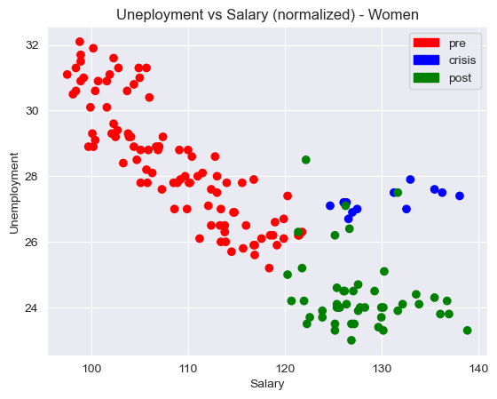
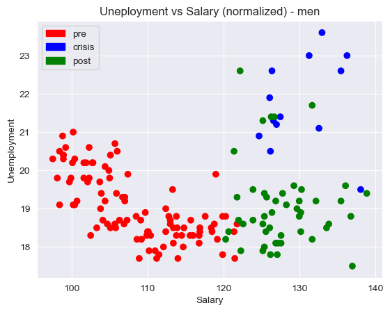

# Workforce Analysis: Gender Differences in Self-Employment and Unemployment

##  Overview

This project analyzes labor market data from Israel's Central Bureau of Statistics, focusing on differences between men and women in self-employment, unemployment, and how COVID-19 affected those dynamics.

 [Original data source](https://www.cbs.gov.il/he/Statistics/Pages/%D7%9E%D7%97%D7%95%D7%9C%D7%9C%D7%99%D7%9D/%D7%9E%D7%97%D7%95%D7%9C%D7%9C-%D7%A1%D7%93%D7%A8%D7%95%D7%AA.aspxn)

---

##  Key Questions

- How did self-employment rates differ between men and women?
- Were men and women influenced by the same factors when deciding to become self-employed?
- How did the relationship between unemployment and self-employment change after COVID?
- Did salary dynamics during COVID reveal structural labor differences between genders?

---

##  Summary of Findings

###  Self-Employment Trends

- The percentage of self-employed **men** is nearly twice that of **women**.
- Men's self-employment remained **stable** over time, while women showed a **clear upward trend**, especially until 2021.

 

  
 

###  Similarities and Differences in Behavior

- After removing long-term trends and seasonality, the **correlation** between male and female self-employment behavior is only **0.02**, suggesting different decision-making factors.
- The **standard deviation** of male self-employment is **nearly twice** that of female data - indicating more variability.

###  COVID Impact on Unemployment & Self-Employment

| Group | Before COVID | After COVID |
|-------|--------------|-------------|
| **Women** | -0.082       | **-0.37**       |
| **Men**   | **-0.33**       | 0.01          |

- **Women** showed a much **stronger negative correlation** between unemployment and self-employment after COVID.
- **Men** showed the **opposite** - the correlation disappeared entirely.
- This supports the hypothesis that **men and women respond differently** to labor market changes.

###  Unemployment & Salary Dynamics

- During COVID, **average and median salaries increased**, especially for **men**, due to a shift in employment composition (fewer low-wage physical jobs).
- This created a **positive correlation** between salary and unemployment - a known crisis phenomenon ([ADP Research, 2025](https://www.adpresearch.com/wp-content/uploads/2025/07/TaW_2025_Issue2-2025.pdf)).
- The effect was **stronger for men**, possibly because low-wage men are more likely to work in physical jobs hit hardest by lockdowns.

 

  
 

 

  
 

---

##  Conclusion

- Before COVID, both genders had a **negative correlation** between unemployment and self-employment.
- After COVID, that relationship **strengthened for women** and **vanished for men**.
- Salary–unemployment dynamics **flipped** during the crisis, affecting **men more strongly**.

These insights suggest structural and behavioral differences between genders in how they respond to labor market shocks.

